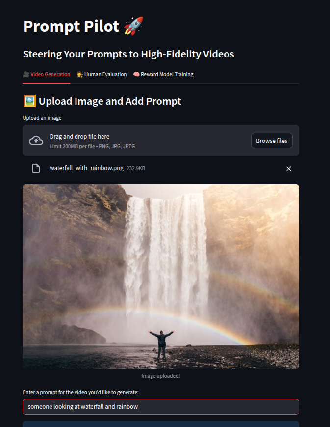
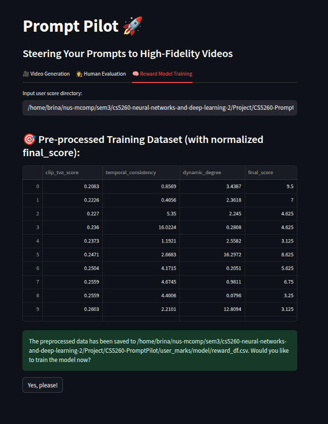

# CS5260-PromptPilot

## Dependencies Installation
Install all necessary dependencies by running the following command.
```
conda create -n promptpilot python==3.9.16
conda activate promptpilot
pip install -r requirements.txt
```

Note that you will also need to download the necessary models required to generate videos using SEINE. Instructions can be found on their GitHub repository: [SEINE](https://github.com/Vchitect/SEINE)

## Dataset and Experimental Results
The curated DIV2K dataset and experimental results are shared on Google Drive: [link](https://drive.google.com/drive/folders/1q01buDiVBR-d9cPTFvBsktBlbrfWEwUv?usp=sharing)

## Presentation
A simple presentation video to introduce the project can be viewed on Google Drive: [link](https://drive.google.com/file/d/1fPJNmZ2WdffMvzpG_CoUHwRzMtvVdwbi/view?usp=sharing)
The deck of slides used in the presentation is also available on Google Drive: [link](https://docs.google.com/presentation/d/1zcDSBQbMacOg1r15r6nd2kSdKV_5D0NcU0X7Dcd-RkI/edit?usp=sharing)

## Prompt Pilot User Interface

### Run
Assuming that `streamlit` is installed, run the following command to launch the interface in a browser.
```
streamlit run tool_app/app.py
```

### Functionalities

Tab `Video Generation`



1. Drag and drop or browse files to upload an image.
2. Input a user prompt.
3. Wait patiently for video generation. Video will display once it is ready.

Tab `Human Evaluation` <br>


1. Input the absolute path to the video directory containing results in the required format. <br>
2. Input your nickname. <br>
3. System loads a sequence of videos along with their generation prompts and displays them for evaluation. 
4. Rate the quality of each video on a scale from 0 to 10 and click "Confirm Score".

Tab `Reward Model Training` <br>



1. Put all annotators' csv files in one folder (by default, `user_marks`, but you could use any other names). Different annotator is put in separate files.
2. Input the absolute path to the folder and press Enter.
3. Pre-processed training data will be displayed as a table.
4. Click the button to begin model training.
5. Once training completes, the model is saved and the test results will be shown.

